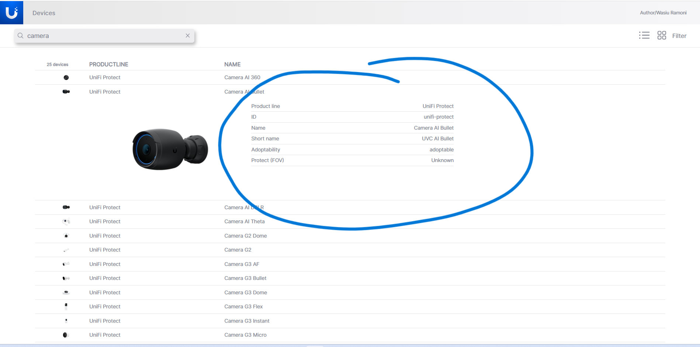
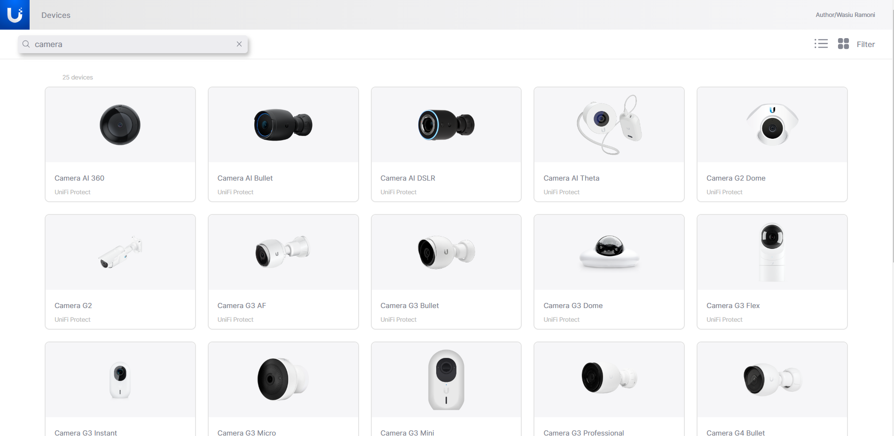
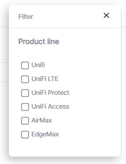

# Ubiquiti Device Search

Welcome to the Ubiquiti device search for in-house staff and developers. We provide this interface for easy access to numerous products we have in stock, including product names, lines, and specifications. The interface is designed to be accessible to all staff members on various devices, ranging from wide-screen monitors and laptops to tablets and small-screen phones.

## Table of Contents

- [Installation](#installation)
- [Usage](#usage)
- [Project Structure](#project-structure)
- [Strong Areas](#strong-areas)
- [Areas to Improve](#areas-to-improve)
- [Testing](#testing)
- [Contributing](#contributing)
- [Appreciation](#appreciation)

## Installation

To get started with this project, follow these steps:

1. Clone this repository to your local machine using the following command:

```

git clone https://github.com/waiz3ple/ubiquiti.git

```

2. Change into the project directory:

```

cd ubiquiti

```

3. Install the dependencies:

```

npm install

```

4. Start the development server:

```

npm start

```

The application will be running at `http://localhost:3000` in your browser.

## Usage

Once the development server is running, you can begin interacting with the search bar, query any product you want, and filter out the different categories available. You can also change the view mode with navigation icons to grid or list view:

- List view is the default home page.
- But you can bookmark either of the views and load from there on future visits.
- The color tone of the page is maintained in grayscale.

## Project Structure

The structure of the project is as follows:

```
Ubiquiti/
  |- public/
  |- src/
    |- assets/
       |- fonts/
       |- images/
    |- components/
       |- DataView/
         |- Card.tsx
         |- GridList.tsx
         |- SpecTable.tsx
         |- TableList.tsx
       |- FilterPanel.tsx
       |- Header.jsx
       |- IconList.tsx
       |- SearchBar.tsx
       |- pages/
         |- Home.tsx
         |- NotFound.tsx
    |- Redux/
      |- features/
       |- data/
          |- Devices.ts
          |- UpdatedData.ts
          |- UpdatedStableData.ts
       |- filterPanel/
          |- Panel.ts
       |- filters/
          |- Filter.ts
       |- search/
          |- Search.ts
       |- Store.ts
    |- Hooks.ts
    |- Util.ts
    |- GlobalStyle.tsx
    |- App.tsx
    |- index.tsx
    |- ...
  |- ...
  |- README.md
  |- ...
```

The `public` directory contains the index HTML file and any other static assets. The `src` directory contains the main application code, including components and the root `App.tsx` file.

## Strong Areas

The following are the areas that are well-handled in this project:

- **Performance**: Since the data is relatively stable, the necessary data for the page is loaded alongside the initial page load and stored. Subsequent activities such as data querying (searching) and filtering are done using the stored data. By default, images load asynchronously, making this approach most suitable. API calls have been reduced to one, and user experience is improved. Memoization could be considered in one or two places.
- **Accessibility**: The application is accessible to users with disabilities. I followed accessibility guidelines and best practices. The application is also responsive and adaptive for all screen sizes.

- **Code Organization**: The code is well-structured. Codes are broken down into components and grouped based on concerns. Functions are grouped into hooks and utilities for better reusability.
- **User Engagement**: The application has an appealing user interface with skeletal loaders that give users an idea of what is coming. A unique spinner derived from the company's logo is used for initial loading. The application is easy to navigate, and overall loading speed is extremely fast, even on low 3G connections.
- **Styling and Animation**: Styled-components were used in this project due to its nesting feature (similar to SASS), ease of passing props, and ability to coexist in the same file with JavaScript and HTML this is great for code organization and file minification. GSAP was used for animations. it makes complex animations easy to understand.
- **Assets and Graphics**: All images used are SVG and they were converted to reusable components. Unique images were drawn using Adobe Illustrator.
- **Error Handling**: All error messages have been improved and are presented in a user-friendly and helpful way.
- **Documentation**: Comments are added to each function and on complex blocks of code.

## Areas to Improve

The following areas need improvement:

- **Font Import**: Unfortunately, I couldn't import the font using ES6 import; here, I had to settle with the commonJS `require` method.
- **Backend**: User authentication needs to be implemented so that users preference can be manage.
- **Clearity**: It will be nice to show Tooltip with meaning of each icon on hovering each navigation icon so user who are not familier with them know what they are.
- **Design**: The design offers two views for users: list view and grid view.

  
  List View

  However, if a user navigates through the grid route, they will not receive the same information as those who navigated through the list route, as device specifications are not available in the grid view. Therefore, the grid view needs to be redesigned or adjusted in such a way that the same information is received regardless of the route token.

  
  Grid View

  The filter panel needs to be draggable so that it does not obstruct the user's view, especially those on small screens. Alternatively, the entire navigation could be redesigned for small screens. It can be made to collapse inside a flyout horizontal list menu.

  
  Filter Panel

- **Testing**: I have only written a few tests; a lot more tests still need to be written.

## Testing

The test environment has been well configured. To run the tests, follow these steps:

1. Run the tests:

```

npm run test

```

2. Check the test coverage report:

```

npm run coverage

```

3. Re-format all changes:

```

npm run format

```

4. Lint the code:

```

npm run lint

```

However, the test environment is configured to run tests, lint, and format before pushing. It will abort pushing to the remote repo if it flags any errors.

## Contributing

Feel free to contribute to this project. You can continue from the area marked as "Areas to Improve".

---

## Appreciation

I wanted to express my sincere appreciation for the opportunity given to me to work on this project assessment. It was an enriching experience, and I wanted to take a moment to thank you for considering me as a candidate for the position.

Thanks!
